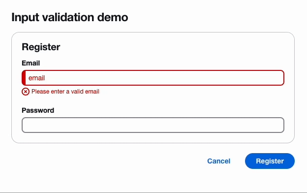

## React-hook-form wrapper for Cloudscape Design System

A React library that simplifies the integration of [`react-hook-form`](https://github.com/react-hook-form/react-hook-form) with [`Cloudscape Design System`](https://github.com/cloudscape-design/components).  It provides a set of pre-built, controlled input components that handle validation, allowing you to focus on building complex form logic with minimal effort.

<p align="left">
  <a href="https://securityscorecards.dev/viewer/?uri=github.com/abudayah/react-hook-form-cloudscape">
    
  </a>
</p>

### Installation

```
npm install react-hook-form @cloudscape-design/components @cloudscape-design/global-styles react-hook-form-cloudscape
```

#### Important

Required dependencies:

- React >= 16.8 || >= 17 || >= 18
- react-dom >= 16.8 || >= 17 || >= 18
- react-hook-form >= 7
- @cloudscape-design/components

### How to use it

```
import { Form, FormField } from '@cloudscape-design/components';
import { CInput } from 'react-hook-form-cloudscape';

function App {
  return (
      <Form>
        <FormField>
          <CInput name="name" ... />
        </FormField>
      </Form>
  );
};

```

## Demo



## Getting help

You can [create bug reports or feature requests](https://github.com/abudayah/react-hook-form-cloudscape/issues/new/choose), or [start a discussion](https://github.com/abudayah/react-hook-form-cloudscape/discussions) to ask a question. To minimize duplicates, we recommend that you search for existing bug reports, feature requests, or discussions before initiating a new thread.

## License

This project is licensed under the [MIT License](/LICENSE).
